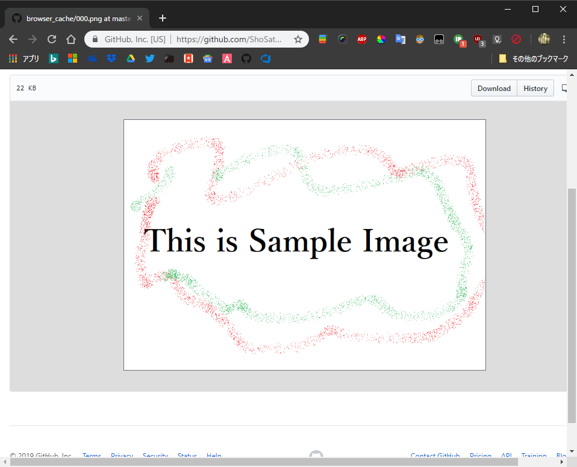
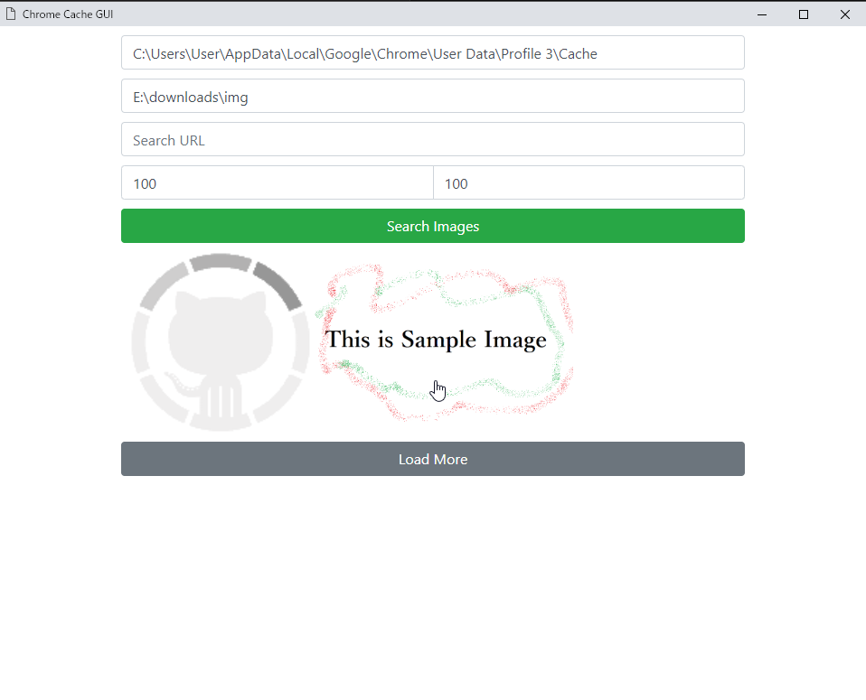
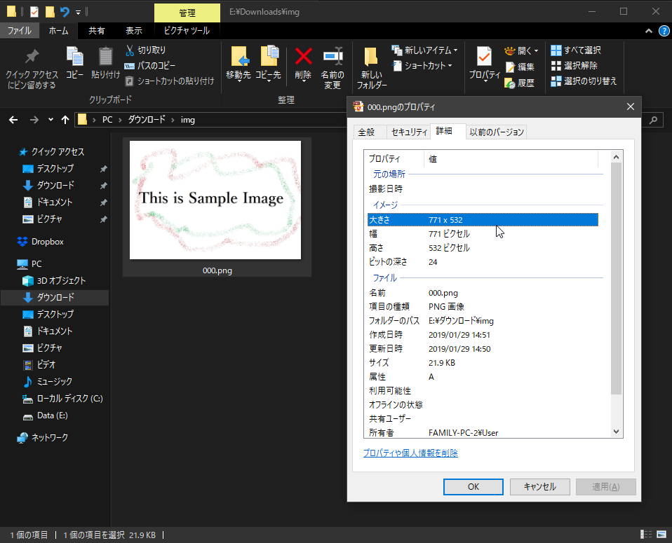

# Chrome Cache GUI
## 1.Browse images on your Chrome browser.

## 2.Launch "Chrome Cache GUI" and specify chrome cache directory and other parameters. Then, click "Search Images" and click the image.

## 3.Now, you can "save" images from cache without connecting internet when you save.



<hr>

# Chrome Cache
## Python module

### Usage
import `chrome_cache.pyd`
```python
from chrome_cache import ChromeCache
cc = ChromeCache("<chrome_cache_dir>", "<temp_dir>")
#keys
print(cc.keys()[:10])
#find and save
cc.find_save("<key>","<path>")

#find
entry = cc.find("<key>")
entry.save("<path>")
header = entry.get_header()
```

### Build
```sh
mkdir cmake_bin
cd cmake_bin
cmake -G "Visual Studio 15 2017 Win64" ..
cmake --build . --target chrome_cache_pyd_debug_static
```
```
include:
    pybind11/pybind11.h (https://github.com/pybind/pybind11)
    pybind11/stl.h
    gzip/decompress.hpp (https://github.com/mapbox/gzip-hpp)
    zlib.h

link:
    zlibd.lib
    python37.lib
```

## Node.js module
### Usage
import `chrome_cache.node`
```js
var chrome_cache = require('chrome_cache');
var cc = new chrome_cache.ChromeCache('<chrome_cache_dir>','<temp_dir>');
//keys
console.log(cc.keys().slice(0, 10));
//find and save
cc.find_save('<key>','<path>');

//find
var entry = cc.find('<key>');
entry.save('<path>');
var header = entry.get_header();
```

### Build
```sh
node-gyp configure --python <python2 executable path>
node-gyp build
```
```
include:
    gzip/decompress.hpp (https://github.com/mapbox/gzip-hpp)
    zlib.h

link:
    zlib.lib
```

## Console Application
### Usage
##### Launch with options
|          |                 |
| -------- | --------------- |
| `-c` | Cache directory       |
| `-k` | URL             |
| `-p` | Output path            |
| `-u` | Reload index |
##### Launch without options
You can use in interactive. When you enter `key`, you can use sub command: `list` to list all keys and `reload` to reload index.  
### Build
```sh
mkdir cmake_bin
cd cmake_bin
cmake -G "Visual Studio 15 2017 Win64" ..
cmake --build . --target chrome_cache_exe_debug_static
```
```
include:
    boost/program_options.hpp
    gzip/decompress.hpp (https://github.com/mapbox/gzip-hpp)
    zlib.h

link:
    zlibd.lib
```


<hr>

# Firefox Cache
## Python module
### Build
```
include:
    pybind11/pybind11.h
    pybind11/stl.h

link:
    python37.lib
```

### Usage
import `firefox_cache.pyd`
```python
from firefox_cache import FirefoxCache
cc = FirefoxCache("<firefox_cache_dir>", "<temp_dir>")
#keys
print(cc.keys()[:10])
#find and save
cc.find_save("<key>","<path>")

#find
entry = cc.find("<key>")
entry.save("<path>")
header = entry.get_header()
```